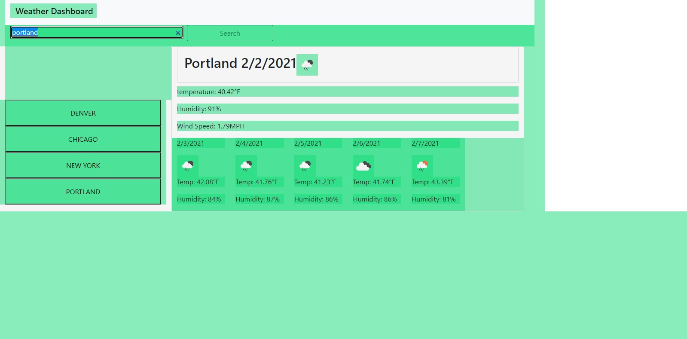

# DU_bootcamp_homework_6_Weather_Dashboard

Homework 6 Assignment WeatherBoard.

In this project I was tasked to create a nice custom weather board. the board needed to be able to look up a city and return the current days weather and the forecast for the next 5 days.

using openweathermap's api I was able to complete this functionality.

I also placed a list of previous cities that were searched so that way they can be clicked to show there info without needing to re search.

this project was alot of fun. I was able to pick up on neet techniques concatanating urls when making api calls.
it was also taught me how to really search through a return object.

to see this site in action please visit https://tevvels.github.io/DU_bootcamp_homework_6_Weather_Dashboard/.

to see the code behind it visit my github https://github.com/Tevvels/DU_bootcamp_homework_6_Weather_Dashboard

